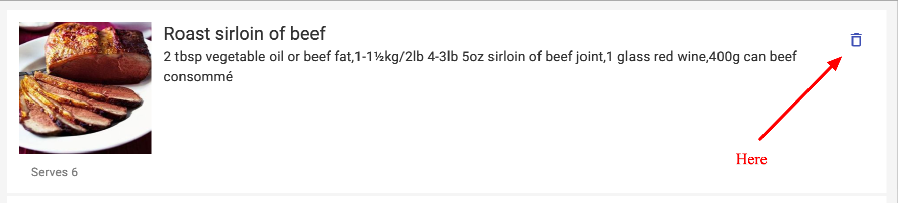

# Spoonly Recipe App

A React recipe search application created using Edamam recipe API.

### Screenshot


### Built with

- HTML/SCSS
- Javascript
- [Material-UI](https://mui.com/)- JS library.
- [React](https://reactjs.org/) - JS library.
- [React Router](https://reactrouter.com/) - JS library for routing in React
- [React Hooks](https://reactjs.org/docs/hooks-intro.html)
- [Context API](https://reactjs.org/docs/context.html)

### What I learned

This was my first project using both Material-UI and context API so the whole project was a learning curve.

With Context API I really like the way all the data is kept in the same place, allowing it to be edited and shared easily between components without having to pass it as props, which can sometimes be messy. I think for future projects it's this way is preferable as it seems much more manageable to keep all these global variables in the same place.

I loved using and learning Material-UI and its easy to see the benefits of using a framework like this to speed up development times when not every part has to be custom.

I believe this project has given me a solid grasp of React Hooks and the React framework in general and I am looking forward to gaining a more in depth knowledge while building future projects.

### Features

The user is first presented with a landing page where they can enter key words to find recipes. After hitting the search button they are presented with a list of recipes to choose from.


Upon selecting the recipe a new tab is opened and if the user would like to save this recipe they can select the bookmark icon on the left hand side of the recipe component.


If the user bookmarks the recipe it will be added to their saved recipes page and committed to local storage. This was achieved using a useState hook and updating the local storage each time a change was made. Each time the application is then opened it first checks for any recipes saved in local storage and updates the app.

```javascript
const fetchSavedRecipes = () => {
  let savedRecipes = JSON.parse(localStorage.getItem(LOCAL_STORAGE_KEY));
  if (!savedRecipes) {
    savedRecipes = [];
  }
  return savedRecipes;
};
```

The user can also delete these recipes by hitting the delete button found on each recipe card component.



### Potential Future Features

- Adding a homepage which includes a feed of recipe suggestions.
- Adding a log in feature so recipes can be accessed from different machines.
